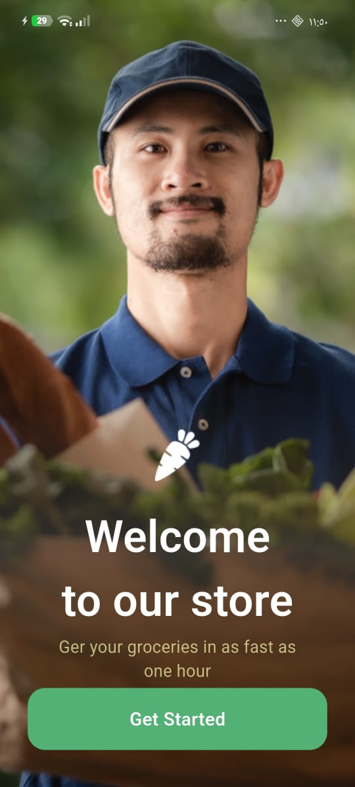
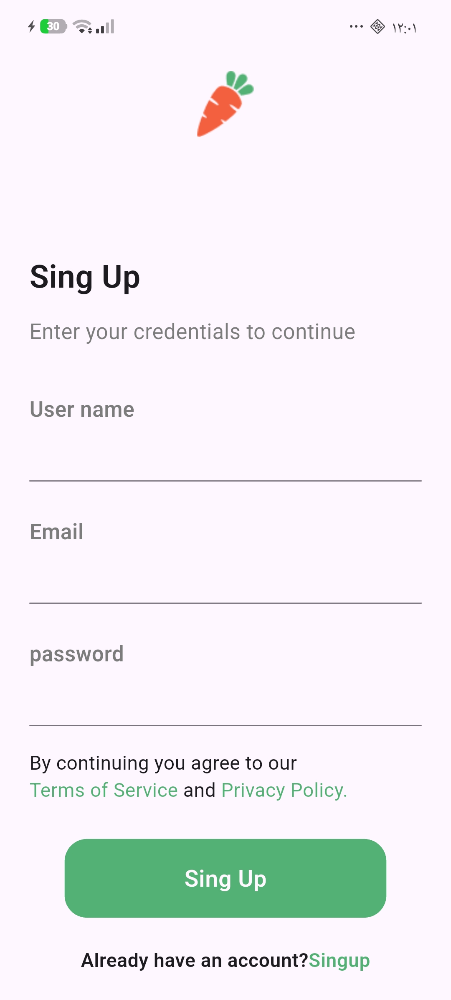
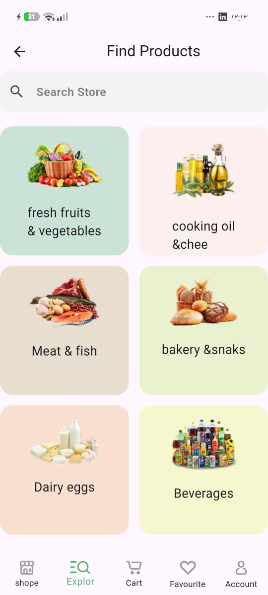
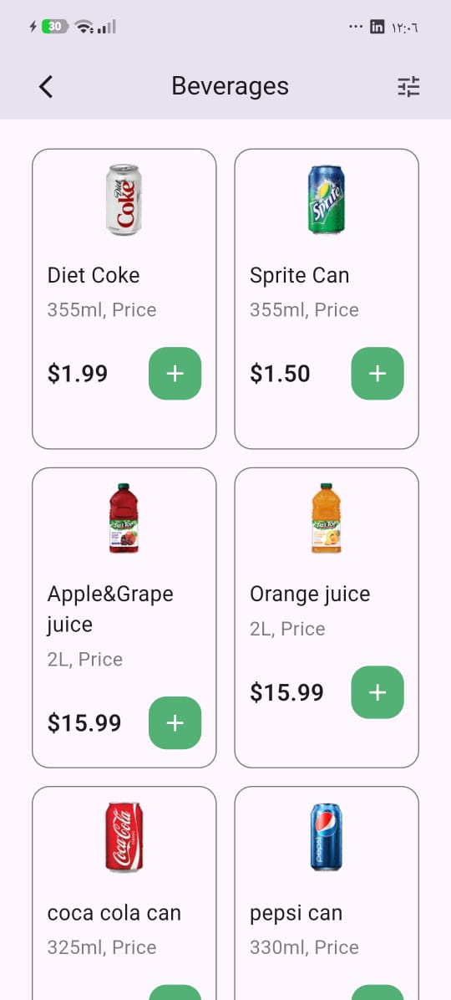
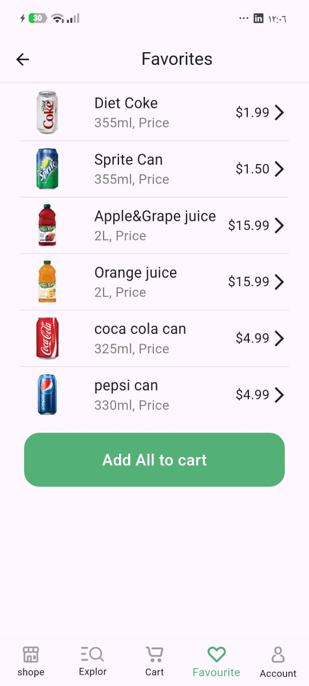
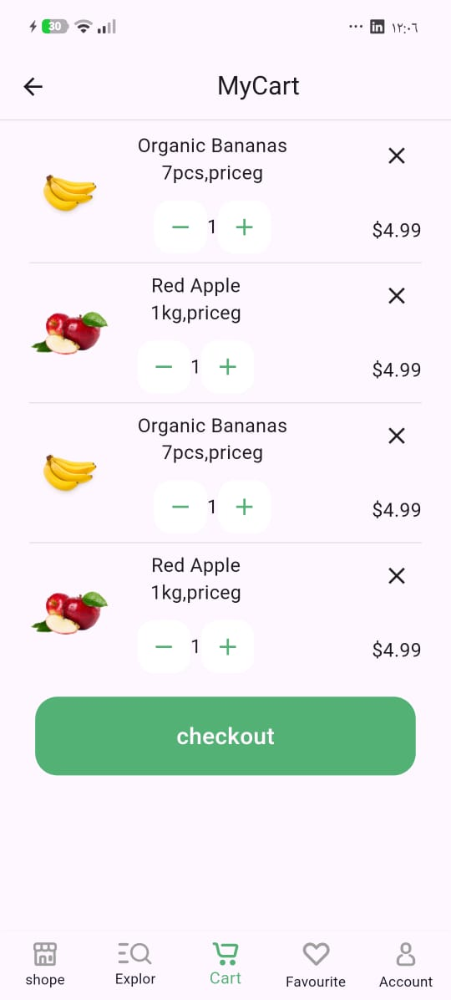
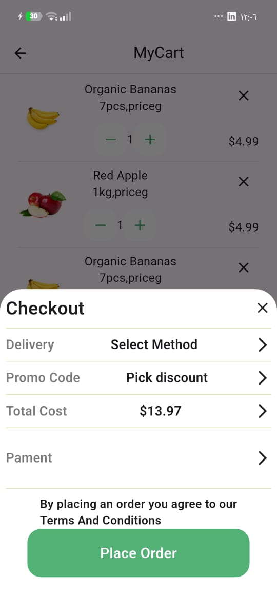
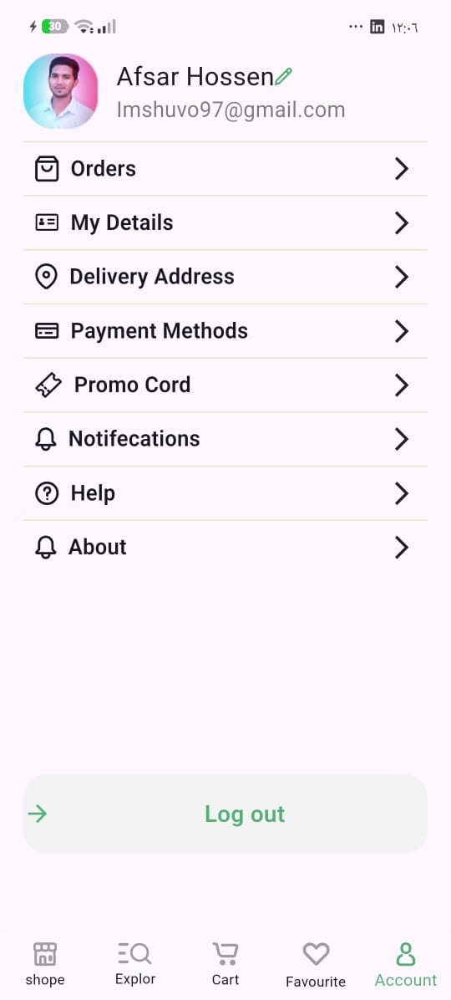

# Grocery App 
A flutter UI project for a modern grocery shopping application.
this project was built as part or my flutter learning journey, focusing on building clean and organized user 
interfaces and practicing navigation between multiple screens.

## Features
- Splash screen
- onboarding screens 
- user authentication UI ( Login & Register)
- Home screen
- Explore screen
- product details
- Favorites
- cart screen
- user account screen
- product carousle 
- custom UI components
- SVG icons and assets

## Technologies 
- flutter
- Dart
- flutter_carousel_ widgets
- flutter_ svg

## Project Structure

The project is organized into separate screens and reusable components.

```text
lib/
├── core/
├── screens/
│   ├── account_screen/
│   ├── cart/
│   ├── explore/
│   ├── favorite/
│   ├── home_screen/
│   ├── login_screen/
│   ├── onboarding_screen/
│   ├── product_details/
│   ├── register_screen/
│   └── splashscreen/
├── grocery.dart
└── main.dart 
```

## APP Screens 

The application includes:
- splash Screen
- Onboarding 
- login
- register
- Home
- Explore
- Product Details
- Favorites
- cart
- Account

## What I Practiced
- Flutter UI development 
- Widget composition
- screen navigation
- working with images and svg assets
- using flutter packages
- organizing project files and screens


##  Screenshots

| Welcome | Sign Up | Login |
|---|---|---|
|  |  |  |

| Home | Explore | Beverages |
|---|---|---|
|  |  |  |

| Favorites | Cart | Checkout |
|---|---|---|
|  |  |  |

| Account |
|---|
|  |

## App Demo 

